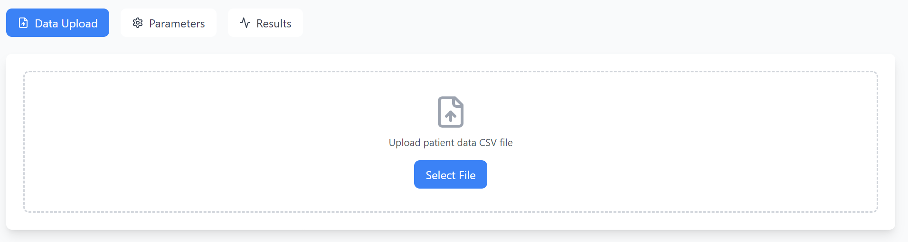
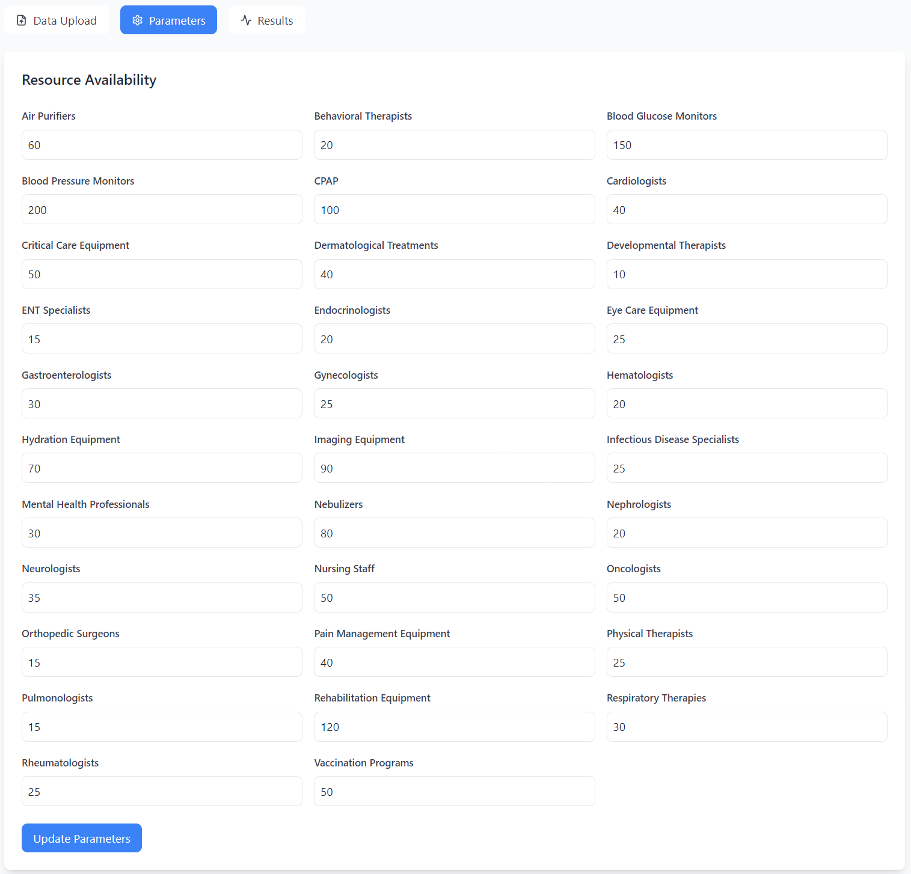
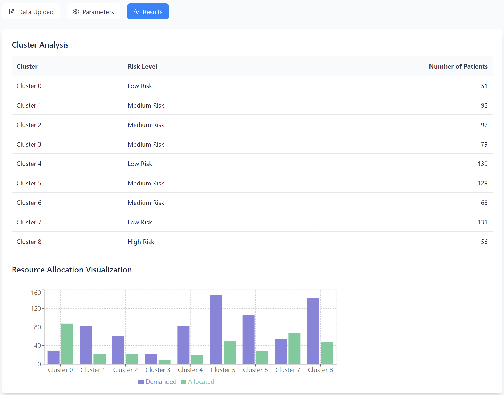

# HealthAlloc Pro
## Healthcare Resource Allocation Dashboard
## User Documentation

### Table of Contents
1. Introduction
2. System Requirements
3. Installation Guide
4. Using the Dashboard
5. Troubleshooting
6. Data Format Specifications

### 1. Introduction
The Healthcare Resource Allocation Dashboard is a web-based application
that helps
healthcare facilities optimize their resource allocation based on patient data
specifically using deceased symptoms and patient profile.
The system uses machine learning to cluster patients and provides intelligent resource distribution recommendations.

### 2. System Requirements
- Python 3.8 or higher
- Node.js 14.0 or higher
- Modern web browser (Chrome, Firefox, Safari, or Edge)
- 4GB RAM minimum
- 1GB free disk space

### 3. Installation Guide

#### 3.1 Initial Setup
1. Clone or download the project repository
2. Create and set up a Python virtual environment (recommended)

```bash
python -m venv venv
source venv/bin/activate  # On Windows use: venv\Scripts\activate
```

#### 3.2 Backend Setup
Navigate to the backend directory and install requirements:
```bash
cd backend
pip install -r requirements.txt
```

#### 3.3 Frontend Setup
Navigate to the frontend directory and install dependencies:
```bash
cd frontend
npm install
```

#### 3.4 Running the Application
From the root directory, run:
```bash
python run.py
```
This will start both the frontend (http://localhost:5173) and backend (http://localhost:5000) servers.

### 4. Using the Dashboard

#### 4.1 Data Upload


*Figure 1: Data upload interface showing the file selection button and upload area*
1. Click the "Data Upload" tab
2. Click "Select File" to choose your CSV file
3. The system accepts CSV files with the following columns:
   - Disease
   - Outcome Variable
   - Age
   - Gender
   - Fever
   - Cough
   - Fatigue
   - Difficulty Breathing
   - Blood Pressure
   - Cholesterol Level

#### 4.2 Parameter Configuration


*Figure 2: Parameter configuration screen showing resource input fields*
1. Navigate to the "Parameters" tab
2. Adjust resource availability numbers:
   - CPAP machines
   - Blood Glucose Monitors
   - Blood Pressure Monitors
   - Other medical equipment
3. Click "Update Parameters" to save changes

#### 4.3 Viewing Results


*Figure 3: Results dashboard showing cluster analysis and resource allocation chart*
The "Results" tab shows:
- Cluster Analysis Table
  - Patient clusters
  - Risk levels
  - Number of patients
- Resource Allocation Chart
  - Demanded vs. Allocated resources
  - Distribution across clusters

### 5. Troubleshooting

#### 5.1 Common Issues
1. Upload Errors
   - Ensure CSV format matches specifications
   - Check file is not corrupted or empty
   - Verify all required columns are present

2. Parameter Updates Not Reflecting
   - Refresh the page
   - Check backend server is running
   - Ensure values are within acceptable ranges

3. Visualization Not Loading
   - Check browser console for errors
   - Ensure screen resolution meets minimum requirements
   - Try refreshing the page

#### 5.2 Error Messages
- "Failed to load parameters": Backend server may be down
- "Failed to process file": CSV format may be incorrect
- "Failed to update parameters": Check network connection

### 6. Data Format Specifications

#### 6.1 CSV File Requirements
```csv
Disease,Outcome Variable,Age,Gender,Fever,Cough,Fatigue,Difficulty Breathing,Blood Pressure,Cholesterol Level
asthma,positive,45,Male,Yes,Yes,Yes,Yes,High,High
```

#### 6.2 Column Specifications
- Disease: String (lowercase with underscores)
- Outcome Variable: "positive" or "negative"
- Age: Integer (0-120)
- Gender: "Male" or "Female"
- Symptoms (Fever, Cough, Fatigue, Difficulty Breathing): "Yes" or "No"
- Blood Pressure: "High", "Normal", or "Low"
- Cholesterol Level: "High", "Normal", or "Low"

#### 6.3 Sample Data Structure
```csv
Disease,Outcome Variable,Age,Gender,Fever,Cough,Fatigue,Difficulty Breathing,Blood Pressure,Cholesterol Level
asthma,positive,45,Male,Yes,Yes,Yes,Yes,High,High
diabetes,positive,62,Female,No,No,Yes,No,High,High
heart_disease,positive,55,Male,No,No,Yes,Yes,High,High
```

### Support
For additional support or to report issues, please contact the system administrator or create an issue in the project repository.

### Note
This documentation assumes basic familiarity with web applications and data analysis concepts. For technical documentation or development guides, please refer to the project's technical documentation.
